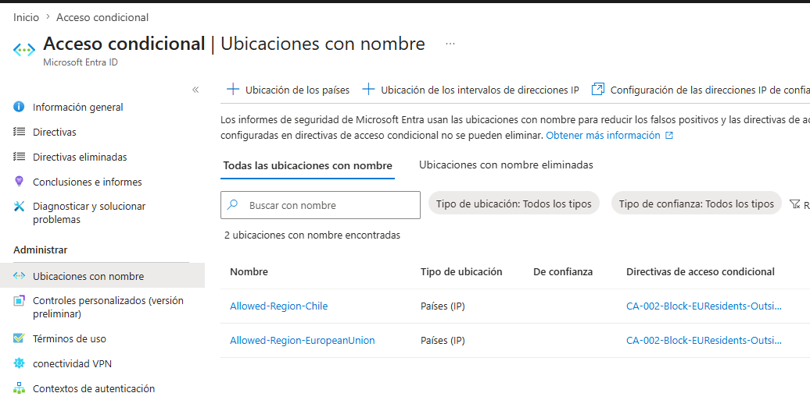
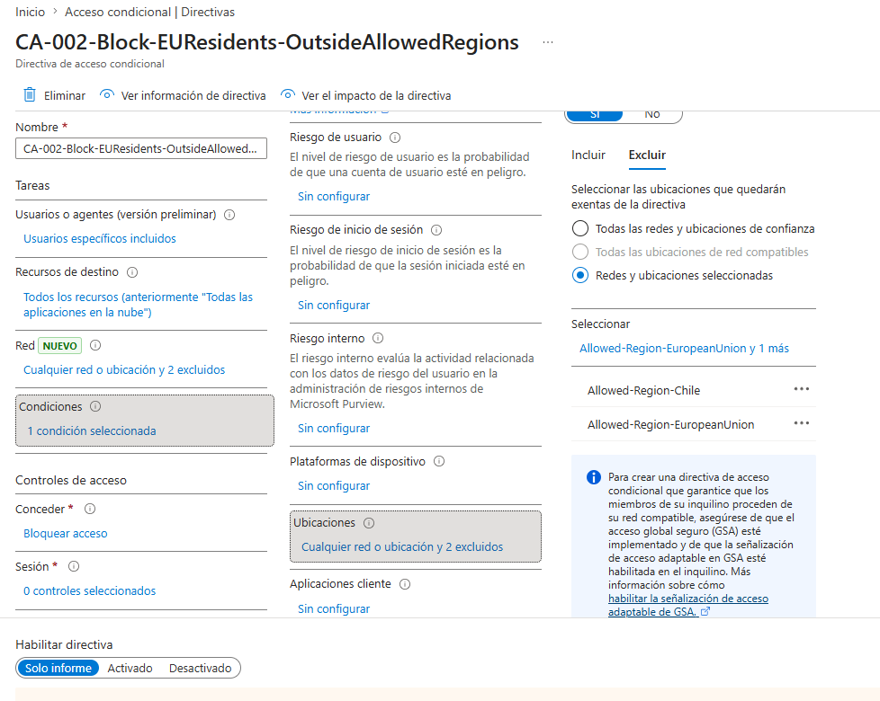
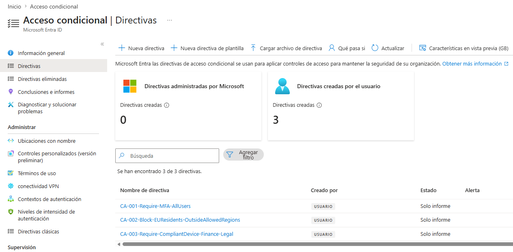
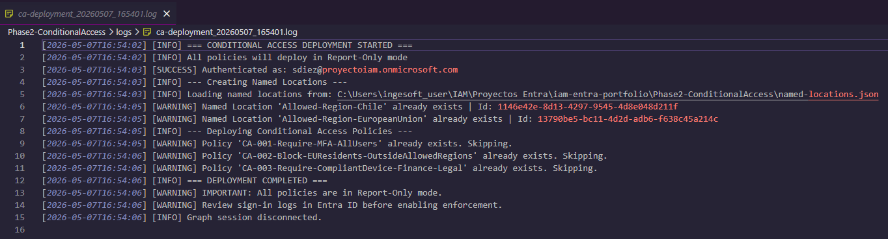

# Phase 2 — Conditional Access Policies

## Overview

This phase implements a **Zero Trust access control layer** on top of the identities provisioned in Phase 1. Three Conditional Access policies are deployed programmatically via Microsoft Graph API, enforcing authentication strength and geographic restrictions aligned to GDPR requirements.

All policies are deployed in **Report-Only mode** by design — a mandatory practice before any enforcement that could impact user access.

---

## Architecture

```
User Sign-In Attempt
        ↓
Entra ID evaluates Conditional Access policies in real time
        ↓
┌─────────────────────────────────────────────────────┐
│  CA-001: Is this ANY user?  → Require MFA           │
│  CA-002: Is this EU resident signing in             │
│          from outside EU/Chile? → Block             │
│  CA-003: Is this Finance/Legal user on              │
│          non-compliant device? → Block              │
└─────────────────────────────────────────────────────┘
        ↓
   Allow / Block / Allow with controls
```

---

## Named Locations

Before deploying policies, geographic zones are defined as **Named Locations** in Entra ID. These are reusable objects referenced across multiple policies.

| Named Location | Countries | Purpose |
|---|---|---|
| `Allowed-Region-Chile` | CL | Permitted region for Chilean users |
| `Allowed-Region-EuropeanUnion` | DE, FR, IT, ES, PT, NL, BE, AT, PL, SE | Permitted region for EU residents |

Defined in `named-locations.json` — separated from script logic so regions can be updated without modifying PowerShell code.



---

## Policies Deployed

### CA-001 — Require MFA for All Users

| Property | Value |
|---|---|
| Scope | All users |
| Applications | All cloud apps |
| Condition | Any sign-in attempt |
| Control | Require MFA (OR) |
| Mode | Report-Only |

**Why this exists:** MFA is the baseline control for any Zero Trust architecture. Even if credentials are compromised, an attacker cannot access resources without the second factor.

**GDPR mapping:** Art. 32 — technical measures appropriate to the risk of unauthorized access to personal data.

---

### CA-002 — Block EU Residents Outside Allowed Regions

| Property | Value |
|---|---|
| Scope | `SG-GDPR-EUResidents` group |
| Applications | All cloud apps |
| Condition | Sign-in from outside EU or Chile |
| Control | Block (hard block, no exception) |
| Mode | Report-Only |

**Why this exists:** EU residents' personal data must be protected under GDPR even at the access layer. If a user classified as an EU resident attempts to connect from an unexpected geography (Asia, Americas outside Chile, etc.), access is blocked entirely.

**Logic breakdown:**
```
Include locations:  ALL
Exclude locations:  Allowed-Region-EuropeanUnion
                    Allowed-Region-Chile
Result: policy triggers only when signing in from anywhere else
```

**GDPR mapping:** Art. 25 (Privacy by Design) + Art. 32 (Technical security measures).



---

### CA-003 — Require Compliant Device for Finance & Legal

| Property | Value |
|---|---|
| Scope | `SG-Finance-Users` + `SG-Legal-Users` |
| Applications | All cloud apps |
| Condition | Any sign-in attempt |
| Control | Require MFA **AND** compliant device |
| Mode | Report-Only |

**Why this exists:** Finance and Legal departments handle the most sensitive data in the organization — financial records and legal documents often containing personal data. MFA alone is insufficient; the device itself must be managed and compliant with organizational security policies (encryption, antivirus, OS patch level via Intune).

**Why AND operator:** Unlike CA-001 which uses OR (either control satisfies access), CA-003 requires both conditions simultaneously. A compliant device without MFA, or MFA from a non-compliant device, are both insufficient.

**GDPR mapping:** Art. 32 — security measures proportionate to the risk. Higher data sensitivity = higher control requirement.

---

## Policies Overview



---

## GDPR Compliance Mapping — Phase 2

| Article | Requirement | Implementation |
|---|---|---|
| Art. 25 | Privacy by Design | Access blocked by default from untrusted locations — allowlist model |
| Art. 32(1)(b) | Confidentiality & integrity | MFA enforced for all users on every sign-in |
| Art. 32(1)(b) | Proportionate measures | Finance/Legal require device compliance in addition to MFA |
| Art. 32(2) | Risk assessment | Geographic restriction for EU residents based on data residency risk |

---

## Report-Only Mode — Why It Matters

```
❌ WRONG approach: deploy policy as "enabled" immediately
✅ CORRECT approach: deploy as "enabledForReportingButNotEnforced" first
```

Report-Only mode allows the policy to evaluate every sign-in and record what **would have happened** — without actually blocking or requiring anything from users. This gives the security team visibility into:

- How many users would be affected
- Whether any service accounts would break
- Whether any legitimate access patterns would be blocked

In a production environment, you would review the **Sign-in logs** in Entra ID (Filter: CA policy = Report-Only result) for a minimum of 2 weeks before switching to `enabled`.

---

## Audit Log

Every deployment generates a timestamped audit log in `logs/`, consistent with the logging pattern established in Phase 1.



---

## Script Features

```
Invoke-ConditionalAccessPolicies.ps1
├── New-NamedLocations()                  — Creates/retrieves geographic zones
│                                           Uses Get-All + Where-Object for reliable
│                                           lookup (Graph -Filter unreliable on this endpoint)
├── Get-GroupId()                         — Resolves group names to Object IDs dynamically
│                                           No hardcoded IDs — works across tenants
├── New-CA001-MFAAllUsers()               — Baseline MFA policy for all users
├── New-CA002-BlockEUResidentsOutsideEU() — Geographic restriction for EU residents
├── New-CA003-CompliantDeviceFinanceLegal()— Device compliance for sensitive departments
└── Write-AuditLog()                      — Consistent audit logging (ISO 8601)
```

---

## How to Run

### Prerequisites

```powershell
Install-Module Microsoft.Graph.Identity.SignIns -Scope CurrentUser
```

### Required Graph API Permissions

| Permission | Purpose |
|---|---|
| `Policy.ReadWrite.ConditionalAccess` | Create and manage CA policies |
| `Policy.Read.All` | Read existing policies (idempotency check) |
| `Group.Read.All` | Resolve group names to Object IDs |

### Configuration

Update `$Config` in `Invoke-ConditionalAccessPolicies.ps1`:

```powershell
$Config = @{
    TenantId          = "your-tenant-id-here"
    LocationsJsonPath = Join-Path $PSScriptRoot "named-locations.json"
}
```

### Execution

```powershell
cd .\Phase2-ConditionalAccess\
.\Invoke-ConditionalAccessPolicies.ps1
```

### Expected Output

```
[INFO]    === CONDITIONAL ACCESS DEPLOYMENT STARTED ===
[INFO]    All policies will deploy in Report-Only mode
[SUCCESS] Authenticated as: admin@yourtenant.onmicrosoft.com
[INFO]    --- Creating Named Locations ---
[SUCCESS] Named Location created: 'Allowed-Region-Chile' | Id: xxxxxxxx
[SUCCESS] Named Location created: 'Allowed-Region-EuropeanUnion' | Id: xxxxxxxx
[INFO]    --- Deploying Conditional Access Policies ---
[SUCCESS] Policy created: 'CA-001-Require-MFA-AllUsers' | Mode: Report-Only
[SUCCESS] Policy created: 'CA-002-Block-EUResidents-OutsideAllowedRegions' | Mode: Report-Only
[SUCCESS] Policy created: 'CA-003-Require-CompliantDevice-Finance-Legal' | Mode: Report-Only
[INFO]    === DEPLOYMENT COMPLETED ===
[WARNING] IMPORTANT: All policies are in Report-Only mode.
[WARNING] Review sign-in logs in Entra ID before enabling enforcement.
```

### Idempotency

The script is safe to re-run. On subsequent executions it detects existing objects and skips creation:

```
[WARNING] Named Location 'Allowed-Region-Chile' already exists. Using existing.
[WARNING] Policy 'CA-001-Require-MFA-AllUsers' already exists. Skipping.
```

---

## Repository Structure

```
Phase2-ConditionalAccess/
├── Invoke-ConditionalAccessPolicies.ps1   # Main deployment script
├── named-locations.json                   # Geographic zone definitions
└── logs/
    ├── logs.md                            # Directory notice (GDPR)
    └── ca-deployment_SUCCESS_sample.log   # Sample audit log
```

---

## Security Practices Demonstrated

- **Report-Only first** — never enforce CA policies without observation period
- **No hardcoded Object IDs** — all IDs resolved dynamically at runtime
- **Idempotent deployment** — safe to re-run without duplicating policies
- **Least privilege API scopes** — only requests permissions required for CA management
- **Separation of data and logic** — named locations defined in JSON, not in script
- **Consistent audit trail** — same logging pattern as Phase 1 for unified compliance record

---

*All policies in this phase are deployed in Report-Only mode. No user access was blocked during the creation of this portfolio.*