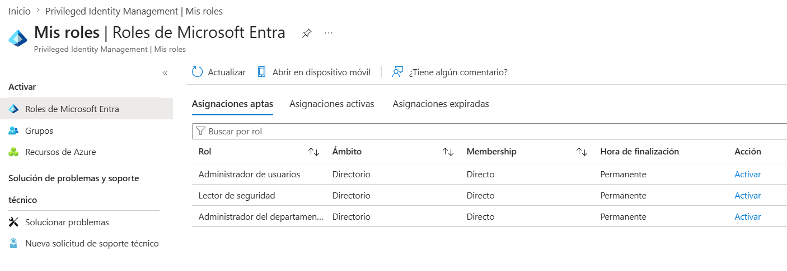
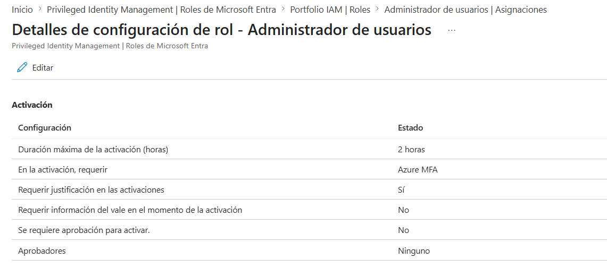
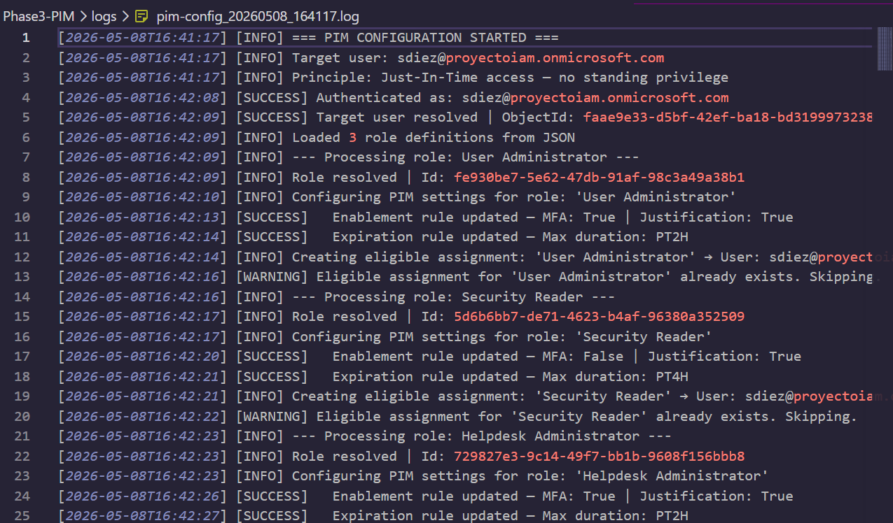

# Phase 3 — Privileged Identity Management (PIM)

## Overview

This phase implements **Just-In-Time (JIT) privileged access** using Microsoft Entra ID Privileged Identity Management. Rather than granting permanent administrative roles, users receive *eligible* assignments that must be explicitly activated with justification and MFA — and automatically expire after a defined window.

This eliminates **Standing Privilege** — one of the most critical attack vectors in enterprise identity security.

---

## The Problem PIM Solves

Without PIM, privileged access looks like this:

```
Admin User ──── Global Administrator role (permanent)
                └── Active 24/7/365
                └── Even when not needed
                └── Full blast radius if account is compromised
```

With PIM (Just-In-Time):

```
Admin User ──── User Administrator (eligible, not active)
                └── To use it:
                    1. Request activation
                    2. Provide written justification
                    3. Complete MFA
                    4. Role active for maximum 2 hours
                    5. Automatically expires — no cleanup needed
```

The attack surface is reduced from **permanent** to **hours**.

---

## Architecture

```
pim-roles.json (role definitions)
        ↓
Invoke-PIMConfiguration.ps1
        ├── Resolve role definition IDs dynamically
        ├── Configure per-role activation settings
        │   ├── Enablement rules  (MFA + justification requirements)
        │   └── Expiration rules  (maximum activation duration)
        └── Create eligible role assignments
            └── No standing privilege — activation required
```

---

## Roles Configured

| Role | Max Duration | Requires MFA | Requires Justification | Rationale |
|---|---|---|---|---|
| `User Administrator` | 2 hours | ✅ Yes | ✅ Yes | Can modify user accounts — high risk |
| `Security Reader` | 4 hours | ❌ No | ✅ Yes | Read-only — lower risk, longer window |
| `Helpdesk Administrator` | 2 hours | ✅ Yes | ✅ Yes | Can reset passwords — high risk |

**Why different durations?** Duration is proportional to risk. Read-only roles (Security Reader) have a longer window because a compromised session causes less damage. Write roles (User Administrator, Helpdesk Administrator) have shorter windows to minimize exposure.

This is direct application of **GDPR Art. 32** — security measures proportionate to the risk.

---

## GDPR Compliance Mapping — Phase 3

| Article | Requirement | Implementation |
|---|---|---|
| Art. 5(1)(f) | Confidentiality | Privileged access window limited to hours, not permanent |
| Art. 25 | Privacy by Design | Privileged access denied by default — requires explicit activation |
| Art. 32(1) | Technical measures | MFA + written justification required before role activation |
| Art. 32(2) | Risk assessment | Activation duration proportionate to role risk level |

---

## PIM Eligible Assignments



---

## Role Settings — User Administrator



---

## Audit Log



---

## Key Concepts

### Eligible vs Active Assignment

| Type | Description | When to use |
|---|---|---|
| **Eligible** | User *can* activate the role on demand | Standard privileged users — JIT model |
| **Active** | Role is permanently assigned and active | Break-glass accounts only |

This portfolio uses **Eligible only** — no standing privilege.

### Standing Privilege vs Just-In-Time

```
Standing Privilege (before PIM):
Timeline: ──────────────────────────────────────────────────►
Access:   [==ADMIN ACCESS ALWAYS ACTIVE====================]
Risk:     High — compromised account = immediate admin access

Just-In-Time (with PIM):
Timeline: ──────────────────────────────────────────────────►
Access:   [──────────────][==2H==][──────────────][==2H==][──]
Risk:     Low — compromised account has no privilege until activated
```

### Activation Flow (User Experience)

When a user needs to use a privileged role:

```
1. Navigate to https://aka.ms/myprivilegedaccess
2. Select eligible role → click "Activate"
3. Enter justification (required by policy)
4. Complete MFA challenge (required for high-risk roles)
5. Role becomes active for configured duration
6. Role expires automatically — no manual deactivation needed
7. Activation is logged in PIM audit history
```

---

## Script Features

```
Invoke-PIMConfiguration.ps1
├── Get-RoleDefinitionId()          — Resolves role names to IDs dynamically
│                                     No hardcoded IDs — works across tenants
├── Get-UserId()                    — Resolves UPN to Object ID for PIM API
├── Set-PIMRoleSettings()           — Configures per-role activation policies
│   ├── Update enablement rule      — Sets MFA and justification requirements
│   └── Update expiration rule      — Sets maximum activation duration
│   NOTE: Uses per-rule PATCH endpoint (Update-MgPolicyRoleManagementPolicyRule)
│         Bulk policy update requires all rules simultaneously — unreliable
└── New-PIMEligibleAssignment()     — Creates eligible assignment via schedule request
                                      Idempotent — skips if assignment already exists
```

---

## How to Run

### Prerequisites

```powershell
Install-Module Microsoft.Graph.Identity.Governance -Scope CurrentUser
```

### Required Graph API Permissions

| Permission | Purpose |
|---|---|
| `RoleManagement.ReadWrite.Directory` | Assign eligible roles |
| `PrivilegedAccess.ReadWrite.AzureAD` | Configure PIM activation settings |

### Configuration

Update `$Config` in `Invoke-PIMConfiguration.ps1`:

```powershell
$Config = @{
    TenantId      = "your-tenant-id-here"
    RolesJsonPath = Join-Path $PSScriptRoot "pim-roles.json"
    TargetUserUPN = "admin@yourtenant.onmicrosoft.com"
}
```

Update `pim-roles.json` to adjust roles, durations, and requirements:

```json
[
  {
    "roleName": "User Administrator",
    "justification": "JIT access for user lifecycle management",
    "maxActivationDuration": "PT2H",
    "requireMFA": true,
    "requireJustification": true
  }
]
```

> Duration format follows ISO 8601: `PT2H` = 2 hours, `PT4H` = 4 hours, `PT8H` = 8 hours.

### Execution

```powershell
cd .\Phase3-PIM\
.\Invoke-PIMConfiguration.ps1
```

### Expected Output

```
[INFO]    === PIM CONFIGURATION STARTED ===
[INFO]    Target user: admin@yourtenant.onmicrosoft.com
[INFO]    Principle: Just-In-Time access — no standing privilege
[SUCCESS] Authenticated as: admin@yourtenant.onmicrosoft.com
[SUCCESS] Target user resolved | ObjectId: xxxxxxxx
[INFO]    Loaded 3 role definitions from JSON
[INFO]    --- Processing role: User Administrator ---
[SUCCESS] Enablement rule updated — MFA: True | Justification: True
[SUCCESS] Expiration rule updated — Max duration: PT2H
[SUCCESS] Eligible assignment created: 'User Administrator' | RequestId: xxxxxxxx
[INFO]    --- Processing role: Security Reader ---
[SUCCESS] Enablement rule updated — MFA: False | Justification: True
[SUCCESS] Expiration rule updated — Max duration: PT4H
[SUCCESS] Eligible assignment created: 'Security Reader' | RequestId: xxxxxxxx
[INFO]    --- Processing role: Helpdesk Administrator ---
[SUCCESS] Enablement rule updated — MFA: True | Justification: True
[SUCCESS] Expiration rule updated — Max duration: PT2H
[SUCCESS] Eligible assignment created: 'Helpdesk Administrator' | RequestId: xxxxxxxx
[INFO]    === PIM CONFIGURATION COMPLETED ===
```

### Idempotency

On re-runs, existing assignments are detected and skipped. Settings are always re-applied to ensure policy drift is corrected:

```
[WARNING] Eligible assignment for 'User Administrator' already exists. Skipping.
[SUCCESS] Enablement rule updated — MFA: True | Justification: True
```

---

## Repository Structure

```
Phase3-PIM/
├── Invoke-PIMConfiguration.ps1    # Main PIM configuration script
├── pim-roles.json                 # Role definitions and activation settings
└── logs/
    ├── logs.md                    # Directory notice (GDPR)
    └── pim-config_SUCCESS_sample.log
```

---

## Security Practices Demonstrated

- **Zero standing privilege** — all roles assigned as eligible, never active permanently
- **Risk-proportionate controls** — MFA and duration requirements scaled to role sensitivity
- **No hardcoded IDs** — role and user IDs resolved dynamically at runtime
- **Idempotent design** — safe to re-run; corrects policy drift without duplicating assignments
- **Separation of config and logic** — role definitions in JSON, not embedded in script
- **Consistent audit trail** — same ISO 8601 logging pattern across all phases

---

## Connection to Other Phases

```
Phase 1 — Users provisioned with least-privilege group membership
Phase 2 — Conditional Access enforces MFA and location restrictions
Phase 3 — PIM eliminates standing privilege for administrative roles  ← YOU ARE HERE
Phase 4 — Access Reviews periodically validate all assignments remain justified
```

PIM without Access Reviews creates a different problem: eligible assignments accumulate over time without review. Phase 4 closes this gap.

---

*Privileged access in this portfolio is configured for a single administrator account using synthetic data. In production, eligible assignments would cover all privileged users across the organization.*