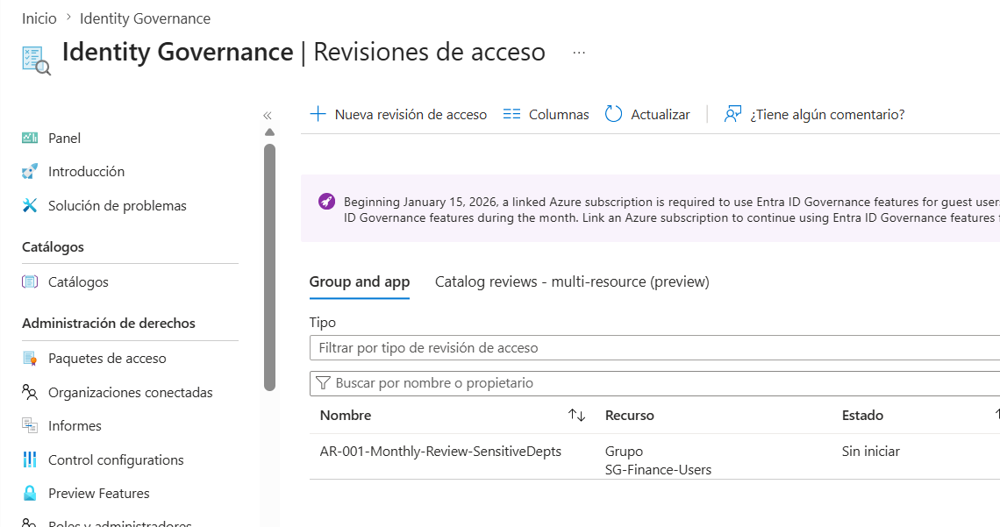
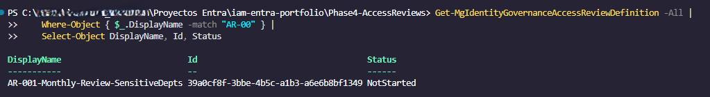
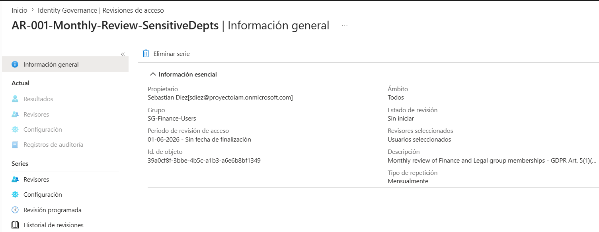

# Phase 4 — Access Reviews & Identity Governance Closure

## Overview

This phase closes the **Identity Governance lifecycle** by implementing periodic Access Reviews — automated, recurring certifications that ensure every access assignment remains justified over time.

Phases 1–3 controlled access at the moment of provisioning. Phase 4 controls access over time, addressing **Permission Creep** — the gradual accumulation of unnecessary permissions that no one reviewed or revoked.

---

## The Permission Creep Problem

Without Access Reviews, access accumulates silently:

```
January:  Laura joins Finance         → SG-Finance-Users assigned ✅
March:    Laura moves to Legal        → SG-Legal-Users added
                                        SG-Finance-Users never removed ⚠️
June:     Laura resigns               → Account disabled
                                        Group memberships remain ❌
December: Audit finds stale access    → Compliance finding 🚨
```

Access Reviews break this cycle by requiring periodic human certification of every access assignment.

---

## Complete IGA Lifecycle

This phase completes the full Identity Governance loop:

```
Phase 1 ──► Provision users with least-privilege access
Phase 2 ──► Enforce access controls (MFA, location, device)
Phase 3 ──► Eliminate standing privilege (JIT via PIM)
Phase 4 ──► Periodically certify all access remains justified  ◄── YOU ARE HERE
    │
    └──► Uncertified access automatically revoked
         └──► Back to Phase 1 for re-provisioning if needed
```

---

## GDPR Compliance Mapping — Phase 4

| Article | Requirement | Implementation |
|---|---|---|
| Art. 5(1)(a) | Lawfulness & transparency | Every access has a named reviewer who certifies it |
| Art. 5(1)(e) | Storage limitation | Access revoked automatically when no longer certified |
| Art. 25 | Privacy by Design | Periodic review is built into the access lifecycle by default |
| Art. 32 | Technical measures | Formal certification process with audit trail per review cycle |

> **GDPR Art. 5(1)(e)** is the most direct mapping: *"personal data shall be kept in a form which permits identification of data subjects for no longer than is necessary."* An unnecessary account or group membership is a form of unnecessary data retention — Access Reviews enforce the cleanup.

---

## Reviews Designed

Three Access Reviews were designed for this portfolio, covering different IAM domains:

### AR-001 — Monthly Review of Sensitive Department Groups
**Status: ✅ Fully functional**

| Property | Value |
|---|---|
| Scope | `SG-Finance-Users` group members |
| Reviewer | IAM Administrator (manager fallback in production) |
| Duration | 7 days to respond |
| Frequency | Monthly |
| Default Decision | **Deny** — access revoked if reviewer does not respond |
| Auto-apply | Enabled — no manual intervention required |
| Recommendations | Enabled — Entra ID suggests Deny for inactive users |
| GDPR Mapping | Art. 5(1)(e) — storage limitation for sensitive data handlers |

Finance and Legal users handle personal data directly. Monthly certification ensures only active, authorized employees retain access to these groups — which in Phase 2 control Conditional Access policies.

### AR-002 — Monthly Review of PIM Eligible Role Assignments
**Status: ⚠️ Designed — requires linked Azure subscription**

| Property | Value |
|---|---|
| Scope | PIM eligible assignments (User Administrator, Security Reader, Helpdesk Administrator) |
| Reviewer | Role holder (self-review) |
| Duration | 7 days |
| Frequency | Monthly |
| Default Decision | **Deny** — eligible assignment removed if not recertified |
| GDPR Mapping | Art. 32 — technical controls for privileged access |

Complements Phase 3 PIM configuration: JIT access prevents standing privilege, but eligible assignments themselves need periodic review. Without this, a user who changed roles would retain eligible assignments indefinitely.

### AR-003 — Monthly Review of Inactive Users
**Status: ⚠️ Designed — requires linked Azure subscription**

| Property | Value |
|---|---|
| Scope | All Member-type users in tenant |
| Reviewer | IAM Administrator |
| Duration | 7 days |
| Frequency | Monthly |
| Default Decision | **Deny** — account disabled if not recertified |
| GDPR Mapping | Art. 5(1)(e) — inactive accounts = unnecessary data retention |

Inactive accounts represent both a security risk and a GDPR compliance gap. A former employee's account with no recent sign-in activity should be reviewed and disabled — this review automates that process.

---

## Environment Limitation — Evaluation Tenant

During the development of this portfolio, AR-002 and AR-003 encountered API constraints specific to evaluation tenants:

```
Error: Query /roleManagement/directory/roleAssignmentScheduleInstances
       is not supported in this context.

Cause: Microsoft policy effective January 15, 2026 — Entra ID Governance
       features for non-group reviews require a linked Azure subscription.

Impact: AR-001 (group-scoped review) is fully functional.
        AR-002 and AR-003 are designed and documented but
        require a production tenant with linked Azure subscription.
```

This is documented transparently as a known environment limitation. The script, JSON definitions, and architectural design are production-ready — the constraint is tenant-level, not design-level.

> In a production environment with a linked Azure subscription, all three reviews would deploy and function as designed. This is a common scenario in real IAM projects: designs are validated in evaluation environments with documented limitations before production deployment.

---

## AR-001 Evidence

### Portal View — Access Review Created



### PowerShell Confirmation — NotStarted Status



### AR-001 Detail



---

## Key Design Decisions

### Default Decision: Deny

All three reviews use `defaultDecision: Deny`. This means:

```
Reviewer responds "Approve" → access maintained ✅
Reviewer responds "Deny"    → access revoked ✅
Reviewer does not respond   → access revoked ✅ (secure by default)
```

The alternative — `defaultDecision: None` — leaves access unchanged if the reviewer is absent. For GDPR compliance, that is not acceptable. Silence is not certification.

### Auto-Apply Results

```
autoApplyDecisionsEnabled: true
```

Without auto-apply, decisions made during a review have no effect until someone manually applies them. In a real organization, this step is often forgotten. Auto-apply removes the human dependency and guarantees that review decisions translate to actual access changes.

### Recommendations Enabled

```
recommendationsEnabled: true
```

Entra ID analyzes sign-in activity and suggests decisions to reviewers. A user who has not signed in for 30+ days receives a "Deny" recommendation. This reduces reviewer fatigue and improves decision quality — reviewers are less likely to approve by default when they see a concrete recommendation.

---

## Script Features

```
Invoke-AccessReviews.ps1
├── New-RecurrencePattern()           — Builds ISO 8601 recurrence for monthly reviews
│                                       startDate set to 1st of next month for clean cycles
├── New-AR001-GroupReview()           — Group membership review (Finance/Legal)
│                                       Uses transitiveMembers query — catches nested members
├── New-AR002-PIMRoleReview()         — PIM eligible role review
│                                       Designed for production — documents tenant limitation
├── New-AR003-InactiveUsersReview()   — Inactive user review
│                                       Designed for production — documents tenant limitation
└── Write-AuditLog()                  — Consistent ISO 8601 audit logging across all phases
```

---

## How to Run

### Prerequisites

```powershell
Install-Module Microsoft.Graph.Identity.Governance -Scope CurrentUser
```

### Required Graph API Permissions

| Permission | Purpose |
|---|---|
| `AccessReview.ReadWrite.All` | Create and manage Access Reviews |
| `Group.Read.All` | Resolve group names to IDs for review scope |
| `RoleManagement.Read.Directory` | Resolve role names for AR-002 scope |
| `User.Read.All` | Resolve reviewer UPNs to Object IDs |

### Configuration

Update `$Config` in `Invoke-AccessReviews.ps1`:

```powershell
$Config = @{
    TenantId         = "your-tenant-id-here"
    ReviewsJsonPath  = Join-Path $PSScriptRoot "access-reviews.json"
    AdminReviewerUPN = "admin@yourtenant.onmicrosoft.com"
}
```

### Execution

```powershell
cd .\Phase4-AccessReviews\
.\Invoke-AccessReviews.ps1
```

### Expected Output (production tenant)

```
[INFO]    === ACCESS REVIEWS CONFIGURATION STARTED ===
[INFO]    Purpose: Close the Permission Creep gap — GDPR Art. 5(1)(e)
[SUCCESS] Authenticated as: admin@yourtenant.onmicrosoft.com
[INFO]    Loaded 3 review definitions from JSON
[INFO]    --- Deploying Access Reviews ---
[SUCCESS] Access Review created: 'AR-001-Monthly-Review-SensitiveDepts' | Id: xxxxxxxx
[SUCCESS] Access Review created: 'AR-002-Monthly-Review-PIMRoles' | Id: xxxxxxxx
[SUCCESS] Access Review created: 'AR-003-Monthly-Review-InactiveUsers' | Id: xxxxxxxx
[INFO]    === ACCESS REVIEWS CONFIGURATION COMPLETED ===
[WARNING] Default decision: Deny — access revoked if not actively certified
[INFO]    Manage reviews at: https://aka.ms/myaccess
```

---

## Repository Structure

```
Phase4-AccessReviews/
├── Invoke-AccessReviews.ps1        # Main Access Reviews configuration script
├── access-reviews.json             # Review definitions (scope, frequency, settings)
└── logs/
    ├── logs.md                     # Directory notice (GDPR)
    └── access-reviews_SUCCESS_sample.log
```

---

## Security Practices Demonstrated

- **Secure by default** — `defaultDecision: Deny` on all reviews, no exceptions
- **No manual dependency** — `autoApplyDecisionsEnabled` removes human bottleneck on result application
- **Recommendation-driven reviews** — sign-in activity informs reviewer decisions
- **Honest limitation documentation** — environment constraints documented transparently
- **Consistent audit trail** — same ISO 8601 logging pattern across all four phases
- **Separation of config and logic** — review definitions in JSON, not embedded in script

---

## Portfolio Complete — Full IGA Lifecycle

With Phase 4, this portfolio demonstrates a complete Identity Governance implementation:

```
┌─────────────────────────────────────────────────────────────┐
│              COMPLETE IGA LIFECYCLE                         │
├─────────────────────────────────────────────────────────────┤
│                                                             │
│  PROVISION          PROTECT           GOVERN               │
│                                                             │
│  Phase 1            Phase 2           Phase 3              │
│  Automated          Conditional       Privileged           │
│  Onboarding    ──►  Access       ──►  Identity        ──►  │
│  (CSV + Graph)      (MFA, Geo,        Management           │
│                     Device)           (PIM / JIT)          │
│                                            │               │
│                                            ▼               │
│                                       Phase 4              │
│                                       Access Reviews       │
│                                       (Certify & Revoke)   │
│                                            │               │
│                                            └──► REPEAT     │
│                                                            │
└─────────────────────────────────────────────────────────────┘
```

| Phase | Domain | Key Concept | GDPR |
|---|---|---|---|
| 1 — Onboarding | Identity Lifecycle | Least Privilege by default | Art. 25, 30 |
| 2 — Conditional Access | Access Control | Zero Trust enforcement | Art. 32 |
| 3 — PIM | Privileged Access | Just-In-Time, no standing privilege | Art. 5(f), 25 |
| 4 — Access Reviews | Governance | Permission Creep prevention | Art. 5(e), 32 |

---

*This portfolio was built on a Microsoft 365 E3 + Entra ID P2 evaluation tenant. All user data is synthetic and created solely for demonstration purposes. Environment limitations are documented transparently throughout.*