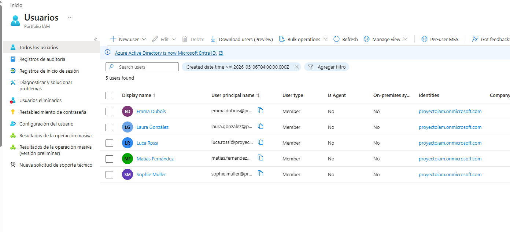
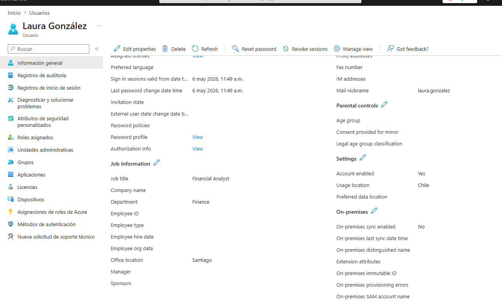
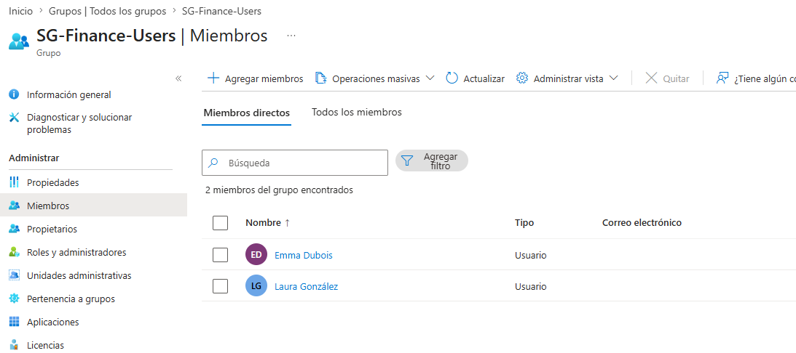
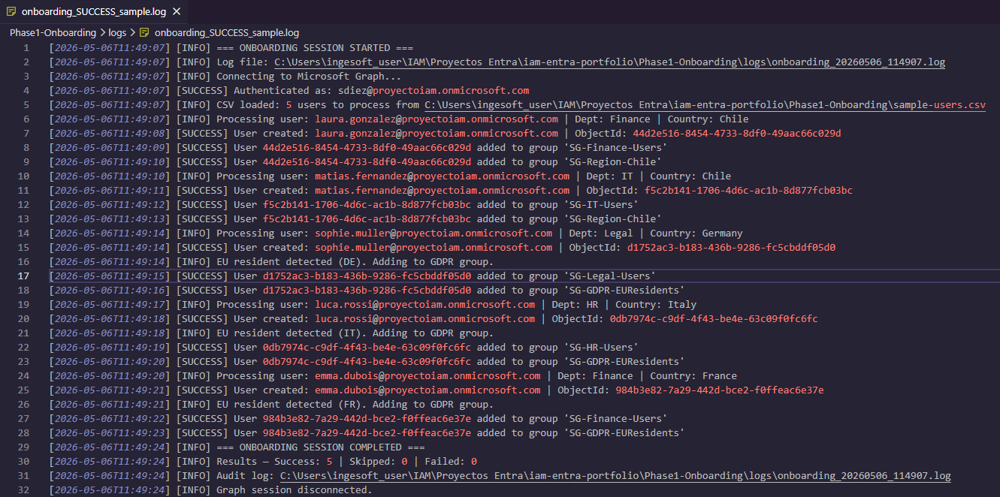

# IAM Engineering Portfolio — Microsoft Entra ID & GDPR Governance


> A hands-on Identity Governance & Administration (IGA) portfolio demonstrating automated identity lifecycle management, least-privilege access control, and GDPR-compliant audit practices using Microsoft Entra ID and PowerShell.

---

## Author

**Sebastián Diez**  
IT Support & Sysadmin → IAM Engineer | 13 years of infrastructure experience  
Microsoft SC-300 Certified | Identity & Access Management  
[GitHub](https://github.com/SebaDiezV/iam-entra-portfolio)

---

## Project Overview

This portfolio simulates a real-world IGA implementation for a multinational organization operating across **Chile** and the **European Union**. Each phase addresses a specific IAM domain, combining technical depth with regulatory compliance requirements.

### Architecture

```
CSV Input (User Data)
        ↓
PowerShell Automation (Microsoft Graph API)
        ├── Input Validation (GDPR Art. 5 - Accuracy)
        ├── User Provisioning (Entra ID)
        ├── Attribute Assignment (Dept, Country, UsageLocation)
        ├── Least-Privilege Group Assignment (GDPR Art. 25)
        └── Audit Logging — ISO 8601 Timestamps (GDPR Art. 30)
```

### Environment

| Component | Details |
|---|---|
| Identity Platform | Microsoft Entra ID (formerly Azure AD) |
| Automation | PowerShell 7 + Microsoft Graph SDK |
| Licensing | Microsoft 365 E3 + Entra ID P2 |
| Regions | Chile (CL) and European Union (DE, FR, IT) |
| Compliance Framework | GDPR (EU) 2016/679 |

---

## Phases

| Phase | Topic | Status |
|---|---|---|
| **Phase 1** | Automated User Onboarding & IGA Foundations | ✅ Complete |
| Phase 2 | Conditional Access Policies | ✅ Complete |
| Phase 3 | Privileged Identity Management (PIM) | 📋 Planned |
| Phase 4 | Access Reviews & Lifecycle Automation | 📋 Planned |

---

## Phase 1 — Automated Onboarding & IGA Foundations

### Objective

Automate the provisioning of users from a structured CSV input, enforce least-privilege access through security group assignment, and generate tamper-evident audit logs — all aligned to GDPR requirements.

### Key Concepts Demonstrated

- **Identity Lifecycle Management** — automated provisioning from HR data source (CSV)
- **Least Privilege by Default** — users receive only the permissions their role requires
- **Privacy by Design** — GDPR compliance is built into the process, not added afterwards
- **Idempotency** — the script can run multiple times without creating duplicate identities
- **Audit Trail** — every action is logged with ISO 8601 timestamps for regulatory traceability

### Security Groups (Least Privilege Model)

Each user is assigned to security groups based on **department** and **geography**. These groups are the foundation for Conditional Access Policies in Phase 2.

| Group | Purpose | Scope |
|---|---|---|
| `SG-Finance-Users` | Finance department access | Role-based |
| `SG-IT-Users` | IT department access | Role-based |
| `SG-Legal-Users` | Legal department — elevated data sensitivity | Role-based |
| `SG-HR-Users` | HR department — personal data handlers | Role-based |
| `SG-GDPR-EUResidents` | EU residents — GDPR-specific policies | Geographic |
| `SG-Region-Chile` | Chile-based users — regional policies | Geographic |

### GDPR Compliance Mapping

| Article | Requirement | Implementation |
|---|---|---|
| Art. 5(1)(d) | **Accuracy** | CSV validation rejects records with missing required fields |
| Art. 5(1)(f) | **Confidentiality** | Cryptographically secure password generation (`RNGCryptoServiceProvider`) |
| Art. 25 | **Privacy by Design** | Least-privilege group assignment is the default — no excess permissions |
| Art. 30 | **Records of Processing** | ISO 8601 timestamped audit log generated per onboarding session |

### Script Features

```
Invoke-BulkOnboarding.ps1
├── Remove-Diacritics()          — Normalizes special characters for valid UPN generation
│                                  (González → gonzalez, Müller → muller)
├── New-SecureTemporaryPassword() — Cryptographically secure password using RNGCryptoServiceProvider
├── Write-AuditLog()             — GDPR Art. 30 compliant logging with ISO 8601 timestamps
├── New-OnboardingUser()         — Idempotent user creation via Microsoft Graph API
└── Add-UserToGroups()           — Least-privilege group assignment by department and country
```

### Evidence

#### Users Created in Microsoft Entra ID


#### User Attributes — Department, Country, UsageLocation


#### Security Group Members — Least Privilege Assignment


#### GDPR-Compliant Audit Log — ISO 8601 Timestamps


### How to Run

#### Prerequisites

```powershell
# Install Microsoft Graph PowerShell SDK
Install-Module Microsoft.Graph -Scope CurrentUser

# Verify installation
Get-Module Microsoft.Graph -ListAvailable
```

#### Required Graph API Permissions

| Permission | Type | Purpose |
|---|---|---|
| `User.ReadWrite.All` | Delegated | Create and manage users |
| `GroupMember.ReadWrite.All` | Delegated | Assign users to security groups |

#### Configuration

Before running, update the `$Config` block in `Invoke-BulkOnboarding.ps1`:

```powershell
$Config = @{
    TenantId      = "your-tenant-id-here"
    DefaultDomain = "yourtenant.onmicrosoft.com"
    CsvPath       = Join-Path $PSScriptRoot "sample-users.csv"
    PasswordLength = 16
}
```

#### CSV Format

```csv
FirstName,LastName,Department,JobTitle,Country,CountryCode,OfficeLocation,Manager
Laura,González,Finance,Financial Analyst,Chile,CL,Santiago,admin@yourtenant.onmicrosoft.com
Sophie,Müller,Legal,Legal Counsel,Germany,DE,Berlin,admin@yourtenant.onmicrosoft.com
```

> **Note:** Special characters (accents, umlauts) in names are supported. The script automatically normalizes them for UPN generation while preserving the original display name.

#### Execution

```powershell
cd .\Phase1-Onboarding\
.\Invoke-BulkOnboarding.ps1
```

#### Expected Output

```
[2026-05-06T11:49:07] [INFO]    === ONBOARDING SESSION STARTED ===
[2026-05-06T11:49:07] [SUCCESS] Authenticated as: admin@yourtenant.onmicrosoft.com
[2026-05-06T11:49:07] [INFO]    CSV loaded: 5 users to process
[2026-05-06T11:49:08] [SUCCESS] User created: laura.gonzalez@yourtenant.onmicrosoft.com | ObjectId: xxxxxxxx
[2026-05-06T11:49:09] [SUCCESS] User added to group 'SG-Finance-Users'
[2026-05-06T11:49:10] [SUCCESS] User added to group 'SG-Region-Chile'
...
[2026-05-06T11:49:24] [INFO]    Results — Success: 5 | Skipped: 0 | Failed: 0
[2026-05-06T11:49:24] [INFO]    === ONBOARDING SESSION COMPLETED ===
```

### Repository Structure

```
iam-entra-portfolio/
├── README.md
├── .gitignore                          # Excludes logs (PII) and secrets
├── Phase1-Onboarding/
│   ├── Invoke-BulkOnboarding.ps1       # Main automation script
│   ├── sample-users.csv                # Test user data (Chile + EU)
│   └── logs/
│       ├── logs.md                     # Directory notice (GDPR)
│       └── onboarding_SUCCESS_sample.log
├── Phase2-ConditionalAccess/           # Coming next
└── docs/
    ├── gdpr-compliance-mapping.md
    └── screenshots/
        ├── 01-users-created.png
        ├── 02-user-detail.png
        ├── 03-group-members.png
        └── 04-audit-log.png
```

---

## Technical Stack

| Technology | Purpose |
|---|---|
| Microsoft Entra ID | Cloud Identity Provider |
| Microsoft Graph API | Programmatic identity management |
| PowerShell 7 | Automation and scripting |
| Microsoft Graph SDK | Graph API abstraction layer |
| Git + GitHub | Version control and portfolio hosting |
| VS Code | Development environment |

---

## Security Practices Demonstrated

- **No hardcoded credentials** — all secrets are handled at runtime
- **Cryptographic password generation** — `RNGCryptoServiceProvider` instead of `Get-Random`
- **SecureString handling** — passwords never exposed as plain text in memory beyond necessity
- **Least privilege API scopes** — script requests only `User.ReadWrite.All` and `GroupMember.ReadWrite.All`
- **PII-aware logging** — audit logs excluded from version control via `.gitignore`
- **Idempotent design** — safe to re-run without creating duplicate identities

---

## Roadmap

- [x] Phase 1 — Automated Onboarding with GDPR audit logging
- [ ] Phase 2 — Conditional Access Policies (MFA enforcement, location-based access)
- [ ] Phase 3 — Privileged Identity Management (Just-in-Time access with PIM)
- [ ] Phase 4 — Access Reviews & automated lifecycle management

---

*Built as a hands-on IAM engineering portfolio. All user data in this repository is synthetic and created solely for demonstration purposes.*